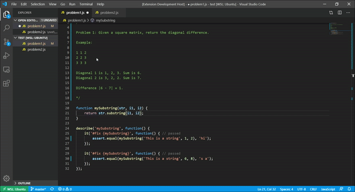

<p align="center">
  
</p>
<h1 align="center">
  <b>p<span style="color:#c10301">APR</span>ika</b>
</h1>
<p align="center">
  An <b><span style="color:#c10301">A</span>utomatic <span style="color:#c10301">P</span>rogram <span style="color:#c10301">R</span>epair</b> tool that attempts to fix small faults in your <i>JS/TS</i> code.
  <br>
  <strong>Developed by <a href="https://github.com/afonsojramos">Afonso Ramos</a></strong>

  <br>
  <br>
  <a href="https://github.com/microsoft/TypeScript/wiki/Using-the-Compiler-API">TypeScript Compiler API</a>
  ·
  <a href="https://mochajs.org/">Mocha</a>
  <br>
  <a href="https://microsoft.github.io/language-server-protocol/">Language Server Protocol</a>
</p>

## Features

-   Live code suggestions
-   Myriad of fault detection



## Usage

On each Test Function of Mocha (`it`) leave an identifier to the function that test is fixing `{mySubstring}`.

Example in JS:

```js
function mySubstring(str, i1, i2) {
	return str.substring(i1, i2)
}

describe('mySubstring Testing Suite', function () {
	it('Test Name 1 {mySubstring}', function () {
		assert.equal(mySubstring('This is a string', 1, 2), 'hi')
	})

	it('Test Name 2 {mySubstring}', function () {
		assert.equal(mySubstring('This is a string', 6, 8), 's a')
	})
})
```

## Structure

```
.
├── client // Language Client
│   ├── src
│   │   ├── test // End to End tests for Language Client / Server
│   │   └── extension.ts // Language Client entry point
├── package.json // The extension manifest.
└── server // Language Server
    └── src
        └── server.ts // Language Server entry point
```

<!-- ## Extension Settings

Include if your extension adds any VS Code settings through the `contributes.configuration` extension point.

For example:

This extension contributes the following settings:

-   `myExtension.enable`: enable/disable this extension
-   `myExtension.thing`: set to `blah` to do something
 -->

## Development

-   Run `npm install` in this folder. This installs all necessary npm modules in both the client and server folder
-   Open VS Code on this folder.
-   Press Ctrl+Shift+B to compile the client and server.
-   Switch to the Debug view.
-   Select `Launch Client` from the drop-down.
-   Run the launch config.
-   If you want to debug the server as well use the launch configuration `Attach to Server`
-   In the [Extension Development Host] instance of VSCode, open a document in 'plain text' language mode.
    -   Type `j` or `t` to see `Javascript` and `TypeScript` completion.
    -   Enter text content such as `AAA aaa BBB`. The extension will emit diagnostics for all words in all-uppercase.

**_Enjoy!_**
